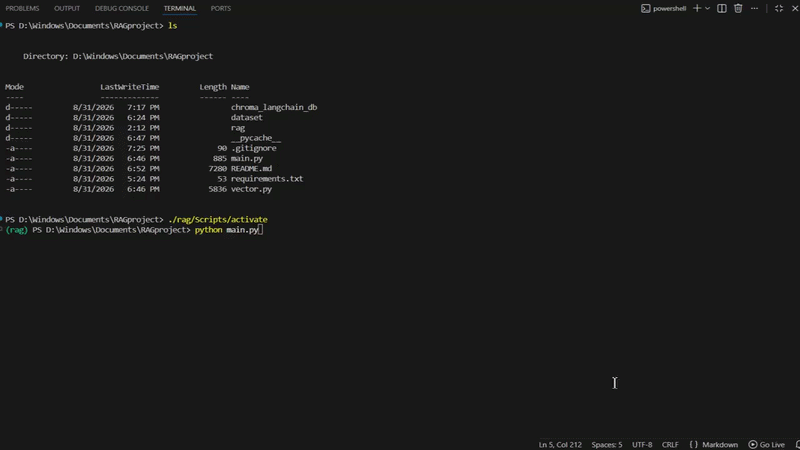

# Local RAG using ChromaDB for CSV files

A lightweight **local Retrieval-Augmented Generation (RAG)** application built with Python, LangChain, Ollama, and ChromaDB.



The project uses an anime dataset as a local knowledge base. Each anime entry is converted into a LangChain document and embedded using a locally running embedding model. The embeddings are stored in ChromaDB, allowing user questions to retrieve semantically relevant anime before passing the retrieved context to a local LLM.

The entire pipeline runs locally without requiring an external LLM API. This Repo uses an Anime Dataset CSV but the Real time Applications are vast. So dont you dare turn away just because its "RAGing" on Anime related data <:

Using this with your own CSV file requires minor tweaks to the "page_content" parameter in vector.py file so as to let LLM know what its looking at.

PS this is a CSV file we are talking about, The one i used is literally ~19k rows so Vectorising all that does take some time depending on your Hardware when running locally, Unfortunately no Shortcuts there. For my 4gb vram it took a decent 19 mins for it to completely process the CSV (Happens only during first time running the program) and store in the Vector Database. Wish you Luck when running on yours 

## How It Works

```text
                 Anime Dataset
                    (CSV)
                      │
                      ▼
               Pandas DataFrame
                      │
                      ▼
             LangChain Documents
                      │
                      ▼
              mxbai-embed-large
                (Embeddings)
                      │
                      ▼
                  ChromaDB
                Vector Store
                      │
                      │
                User Question
                      │
                      ▼
                  Retriever
                  Top-K Anime
                      │
                      ▼
               Retrieved Context
                      │
                      ▼
                  Llama 3.2
                      │
                      ▼
                    Answer
```

## Tech Stack

* **Python**
* **LangChain** — RAG pipeline and document handling
* **Ollama** — Local model and embedding execution
* **Llama 3.2** — Local LLM
* **mxbai-embed-large** — Local embedding model
* **ChromaDB** — Persistent local vector database
* **Pandas** — Dataset loading and processing

## Dataset

The knowledge base contains approximately **19,000 anime entries** with information including:

* Anime title
* Synopsis
* Genre
* Aired dates
* Number of episodes
* Number of members
* Popularity
* Ranking
* Score
* MyAnimeList image URL
* MyAnimeList URL

For semantic retrieval, the primary document content consists of the anime's:

* Title
* Synopsis
* Genre
* Aired information

Additional information such as score, ranking, popularity, episode count, and links is stored as document metadata.

## Dataset Source

The dataset used in this project is sourced from the [`cckuqui/anime-db`](https://github.com/cckuqui/anime-db) repository.

The repository combines anime data from **MyAnimeList** and **Crunchyroll** using an ETL process with Python and PostgreSQL. The MyAnimeList source data used by this project contains anime titles, synopses, genres, airing information, episode counts, popularity, rankings, and related metadata.

* **Source Repository:** [`cckuqui/anime-db`](https://github.com/cckuqui/anime-db)
* **Data source:** MyAnimeList dataset referenced by the repository
* **Format:** CSV

The dataset is used as the knowledge base for experimenting with a local Retrieval-Augmented Generation pipeline.

## Project Structure

```text
.
├── main.py
├── vector.py
├── anime.csv
├── requirements.txt
├── .gitignore
└── README.md
```

The `chroma_langchain_db/` directory is generated locally during the first indexing process and is intentionally excluded from Git.

## Setup

### 1. Clone the repository

```bash
git clone https://github.com/syed177013/Local-RAG-using-ChromaDB-for-CSV-files.git
cd Local-RAG-using-ChromaDB-for-CSV-files
```

### 2. Install dependencies

```bash
pip install -r requirements.txt
```

### 3. Install Ollama

Install Ollama for your operating system and make sure it is running.

Pull the required models:

```bash
ollama pull llama3.2
ollama pull mxbai-embed-large
```

### 4. Build the Vector Database OR directly go to Step 5.

On the first run, the anime dataset is processed and embedded into ChromaDB.

```bash
python vector.py
```

The ingestion process uses batched embedding requests and displays progress while the vector database is being created.

> **Note:** The initial indexing process can take several minutes depending on your hardware because the embeddings are generated locally. Once the vector database has been created, subsequent runs reuse the existing embeddings instead of rebuilding the database.

### 5. Run the RAG application

```bash
python main.py
```

The application will prompt you for questions about the anime dataset.

## Example Questions

```text
Ask your Question (q to quit): Recommend anime about revenge.

Ask your Question (q to quit): Find anime involving magic and adventure.

Ask your Question (q to quit): What are some highly rated psychological anime?

Ask your Question (q to quit): Recommend anime similar to a dark fantasy story.

Ask your Question (q to quit): Find anime with fewer than 13 episodes.
```

The system retrieves the most relevant anime entries from ChromaDB and provides them as context to Llama 3.2 before generating a response.

## RAG Pipeline

The implementation consists of three main stages.

### 1. Ingestion & Embedding

The anime CSV is loaded using Pandas.

Each anime is converted into a LangChain `Document`. Semantic information such as the title, synopsis, and genre is used as the primary content for embedding.

The documents are embedded using `mxbai-embed-large` through Ollama and stored in ChromaDB.

The ingestion process uses batching to improve embedding throughput and displays progress and estimated completion time.

### 2. Retrieval

When a user asks a question, the question is passed to the ChromaDB retriever.

The retriever performs a similarity search against the stored embeddings and returns the **top 5 most relevant anime entries**.

### 3. Generation

The retrieved anime information is inserted into a prompt and passed to the locally running **Llama 3.2** model.

The model generates its response using the retrieved anime information as context.

## Incremental Indexing

The vector database is persistent and stored locally in:

```text
chroma_langchain_db/
```

The ingestion pipeline checks which anime entries have already been indexed using their unique `uid`.

This means that if indexing is interrupted or the dataset is updated, already-processed entries do not need to be embedded again.

## Running Completely Locally

The complete RAG pipeline runs locally:

```text
Embeddings → mxbai-embed-large via Ollama
Vector Store → ChromaDB
LLM → Llama 3.2 via Ollama
```

No external LLM API is required.

## Current Scope

This project is intentionally focused on understanding the fundamentals of a local RAG pipeline:

* Loading structured data
* Handling missing dataset values
* Creating LangChain documents
* Generating local embeddings
* Batch processing
* Persistent vector storage
* Similarity-based retrieval
* Passing retrieved context to an LLM
* Running the complete pipeline locally

This version uses **one anime entry per document** and does not perform text chunking.

Future iterations may explore document chunking, additional data formats, improved retrieval strategies, metadata filtering, source attribution, and a user interface.
